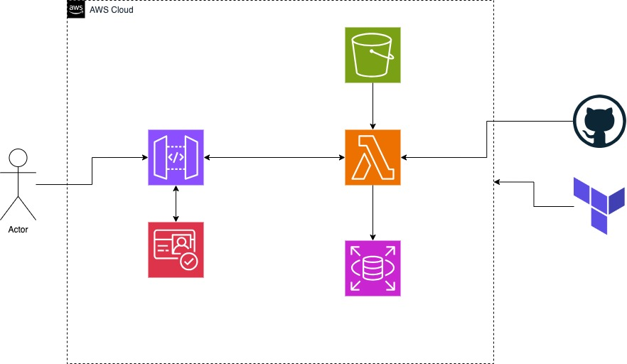
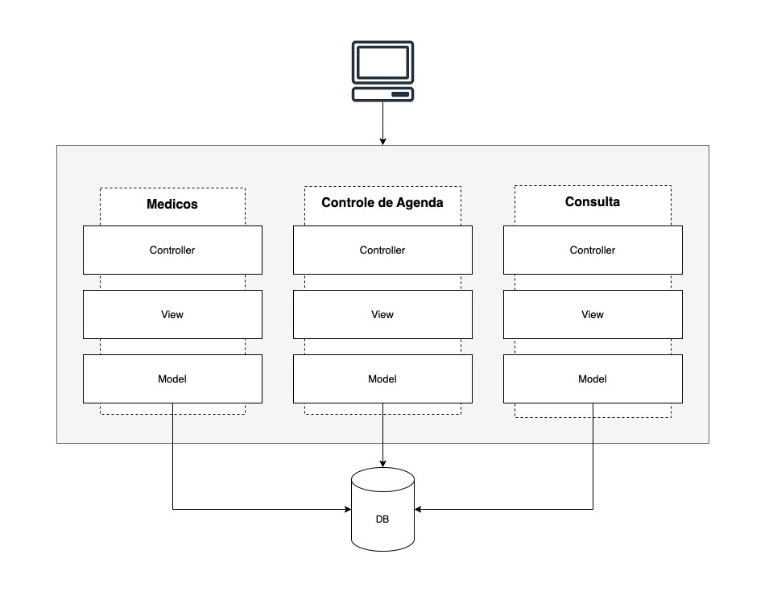

# HEALTH MED API

Hackathon FIAP SOAT4

## Desenho de Arquitetura Cloud


- Cognito
- Api Gateway
- Lambda
- RDS
- Terraform
- Github


## Desenho Solução
Foi adotado uma arquitetura Monolítica MVC por ser uma API BFF pequena, com pacotes separados para que uma quebra em microserviços seja fácil.



Alguns beneficios da arquitetura apresentada:
- Simplicidade e Facilidade de Desenvolvimento
- Menor latência
- Custo de Infraestrutura
- Rapidez no Desenvolvimento

A Microsoft fornece uma visão detalhada sobre quando escolher uma arquitetura monolítica versus uma arquitetura de microservices, destacando a simplicidade e eficiência da abordagem monolítica para aplicações menores.

[Monolithic vs. microservices architecture](https://docs.microsoft.com/en-us/azure/architecture/guide/architecture-styles/microservices)

# Passo a passo para rodar o projeto localmente

Siga os passos abaixo para configurar e rodar o projeto localmente em sua máquina.

## Pré-requisitos

- Node.js (versão 18 ou superior)
- npm (versão 10 ou superior)
- Docker

## Passos
1. **Instale as dependências:**
```sh
npm install
```

2. **Configure as variáveis de ambiente:**
Na raiz do projeto edite o arquivo **.env** para usar a variavel DATABASE_HOST de acordo com o S.O. utilizado

3. **Inicie o banco de dados
Use o comando ***docker compose up** para iniciar o banco de dados e o pgAdmin

4. **Inicie o serviço de API
```sh
npm run start
```

5. **Utilize a healthmed_insomnia da pasta **assets** para efetuar as requests**
